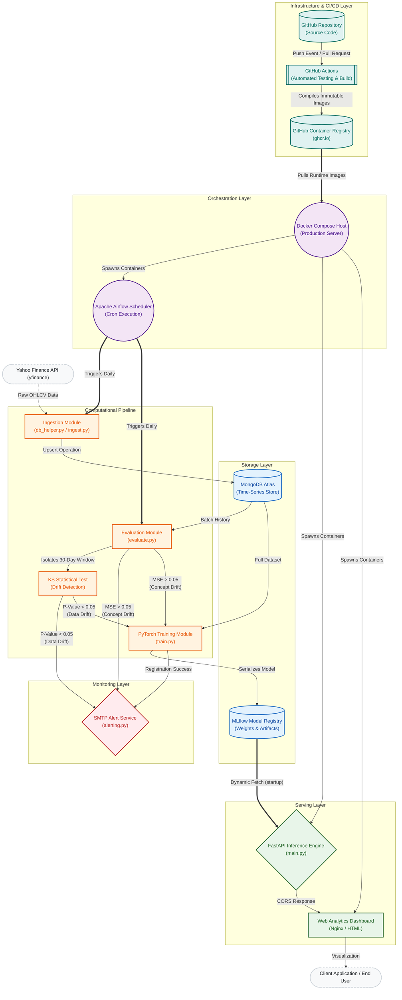

# Enterprise Financial MLOps Pipeline

<p align="center">
  
  
  
  
  
  
  
  
</p>

---

## 1. Executive Summary

This repository contains the architecture and implementation of an automated, Enterprise-Grade Machine Learning Operations (MLOps) pipeline. Designed specifically for quantitative financial forecasting, the system orchestrates the complete lifecycle of a Deep Learning model—from automated market data ingestion and rigorous temporal modeling, to continuous evaluation, statistical drift detection, and low-latency prediction serving.

Currently calibrated for equity prediction (default ticker: `BBCA.JK`), the modular design pattern ensures horizontal scalability and adaptability to any continuous time-series regression task. The pipeline adheres to strict software engineering standards, integrating rigorous memory management, proactive monitoring, and automated containerized deployments.

---

## 2. Core Architectural Components

### 2.1. Deep Learning Engine (PyTorch)
The core predictive capability is driven by a Long Short-Term Memory (LSTM) neural network. To ensure stability within resource-constrained production environments, the training pipeline utilizes PyTorch `DataLoader` for efficient mini-batch processing. Additionally, the system employs aggressive Python garbage collection (`gc.collect()`) and strict limitations on Intel MKL/OpenMP thread allocation, virtually eliminating the risk of Out-Of-Memory (OOM) anomalies during large-scale matrix operations.

### 2.2. Proactive Statistical Data Drift Detection
Financial markets exhibit extreme non-stationarity. To maintain predictive integrity, the evaluation module executes a two-sample **Kolmogorov-Smirnov (KS) Test** (`scipy.stats.ks_2samp`) on a daily cadence. The system isolates the trailing 30-day market distribution (current data) and mathematically compares it against the foundational distribution utilized during model training (reference data). If the test yields a P-Value of `< 0.05`, the system concludes that statistically significant data drift has occurred and preemptively triggers a retraining protocol before standard performance metrics decay.

### 2.3. Automated Model Registry & Experiment Tracking
The pipeline leverages **MLflow** hosted via DagsHub as the centralized source of truth for model lineage. Upon successful training, models are not merely saved locally; they are serialized and registered into the MLflow Model Registry under a unified identifier (`Finance_LSTM_Stock_Predictor`). The registry automatically handles versioning, logs deterministic hyperparameters, records loss metrics, and archives validation plots as persistent artifacts.

### 2.4. Real-Time SMTP Alerting Service
To eliminate the requirement for constant manual dashboard monitoring, a custom asynchronous alerting module (`alerting.py`) is integrated into the orchestration flow. Utilizing authenticated SMTP protocols, the system dispatches immediate operational notifications to designated engineering endpoints. Alerts are triggered upon the detection of Data Drift, the breach of Mean Squared Error (MSE) thresholds (Concept Drift), or upon the successful compilation and registration of a new model version.

### 2.5. Scalable Deployment & Continuous Integration
Prediction serving is decoupled from the modeling layer via a **FastAPI** application. Upon instantiation, the API dynamic fetches the latest production-approved model directly from the MLflow Registry, ensuring the serving layer is always utilizing the most optimal weights. The entire infrastructure—including Apache Airflow schedulers, PostgreSQL metadata databases, and the FastAPI application—is containerized via **Docker Compose**. Integrity is guaranteed by a **GitHub Actions** CI/CD pipeline which automatically tests dependencies and pushes immutable container images to the GitHub Container Registry (GHCR).

---

## 3. Comprehensive System Architecture Diagram



---

## 4. Repository Structure

```text
Finance-MLOps/
├── .github/workflows/       # CI/CD pipeline definitions
├── api/
│   └── app/main.py          # FastAPI application entrypoint (Registry integration)
├── frontend/
│   ├── index.html           # Dashboard structural markup
│   ├── style.css            # Premium visual stylings
│   └── app.js               # Analytics rendering orchestration
├── dags/
│   └── mlops_pipeline.py    # Apache Airflow directed acyclic graph architecture
├── data_pipeline/
│   └── src/
│       ├── db_helper.py     # MongoDB persistence utility wrappers
│       └── ingest.py        # Financial data extraction logic
├── ml_service/
│   └── src/
│       ├── model.py         # PyTorch LSTM Neural Network definition
│       ├── train.py         # Model fitting, MLflow logging, and Memory Optimization
│       ├── evaluate.py      # Statistical KS Drift Test and MSE validation
│       └── alerting.py      # Automated SMTP push notification engine
├── test_alert.py            # CLI utility for verifying SMTP configurations
├── Dockerfile.airflow       # Airflow environment specification
├── Dockerfile.api           # FastAPI server specification
├── Dockerfile.frontend      # Nginx web serving environment
├── docker-compose.yml       # Multi-container orchestration definitions
├── requirements.txt         # Explicit Python dependencies (Strict Versioning)
└── .env                     # Configuration variables (Excluded from Version Control)
```

---

## 5. Deployment Configuration

### 5.1. System Prerequisites
Deployment requires the following dependencies installed on the host machine:
* Docker Engine (v20.10+) and Docker Compose (v3.8+)
* Python 3.10+ (Required only for local non-containerized execution)
* Active MongoDB Atlas cluster and connection string
* Authenticated DagsHub/MLflow account

### 5.2. Environment Variable Specification
Create a `.env` file at the root directory. The `docker-compose.yml` is configured to natively inject these variables into all corresponding containers.

```env
# Database Parameters
MONGO_URI=mongodb+srv://<user>:<pass>@cluster.mongodb.net/
DB_NAME=finance_mlops
COLLECTION_NAME=stock_data
TICKER=BBCA.JK

# MLflow / Registry Authentication
MLFLOW_TRACKING_URI=https://dagshub.com/<username>/Finance-MLOps.mlflow
MLFLOW_TRACKING_USERNAME=<username>
MLFLOW_TRACKING_PASSWORD=<dagshub_token>

# SMTP Alerting Configuration
GMAIL_USER=your.email@gmail.com
GMAIL_APP_PASSWORD=your_16_digit_app_password
ALERT_RECEIVER_EMAIL=receiver.email@gmail.com
```

### 5.3. Executing the Infrastructure via Docker Compose
The entire infrastructure stack—comprising PostgreSQL for Airflow metadata, Airflow Init, Scheduler, Webserver, and the FastAPI application—is orchestrated via Docker Compose.

1. **Initialize the Airflow Database Schema:**
```bash
docker-compose up airflow-init
```
2. **Launch Core Services (Detached Mode):**
```bash
docker-compose up -d
```
3. **Validate Operational Status:**
- **Visual Analytics Dashboard:** `http://localhost:8081`
- **Airflow Web Interface:** `http://localhost:8080` (Authentication: `airflow` / `airflow`)
- **FastAPI Documentation (Swagger UI):** `http://localhost:8000/docs`

---

## 6. Continuous Integration & Continuous Deployment (CI/CD)

The repository enforces strict CI/CD protocols utilizing **GitHub Actions**. Any modifications pushed to the `main` branch trigger the automated pipeline.

1. **Test Phase:** The pipeline allocates a transient Ubuntu runner, provisions Python 3.10, installs dependencies, and verifies the compilation integrity of the PyTorch neural network.
2. **Image Compilation:** Upon test validation, the pipeline executes isolated builds for `Dockerfile.api` and `Dockerfile.airflow`.
3. **Registry Distribution:** The compiled, production-ready images are securely pushed to the GitHub Container Registry (GHCR), ensuring immutable deployment artifacts.

---

## 7. License
This intellectual property is distributed under the conditions explicitly stated within the included `LICENSE` file.