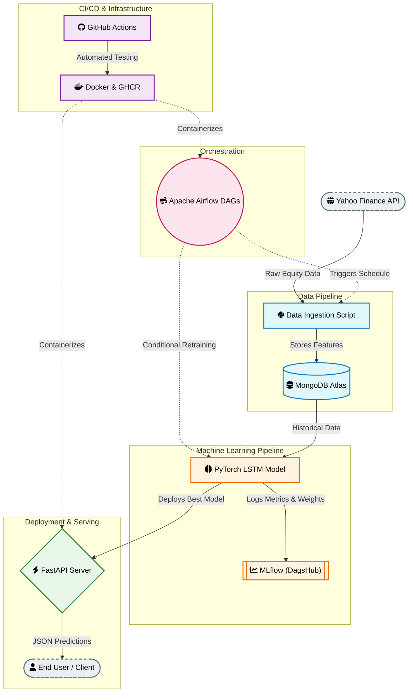

# Financial MLOps Pipeline

<p align="center">
  
  
  
  
  
  
  
</p>


## Project Overview

This repository contains an automated, end-to-end Machine Learning Operations (MLOps) pipeline designed for stock price prediction and financial market analysis. The system automates the complete lifecycle of a Deep Learning model, ranging from daily data ingestion and feature engineering to continuous model retraining, experiment tracking, and real-time deployment via an API interface.

Built around predicting equity data (specifically focused on BBCA.JK tickers as default), this project serves as a blueprint for enterprise-grade ML orchestration using Docker containerization, workflow managers, and cloud data warehouses.

## Key Architecture Features




*   **Automated Ingestion:** Automated fetching of market data via `yfinance` with persistence layer managed in MongoDB Atlas.
*   **Deep Learning Forecasting:** Implements an LSTM (Long Short-Term Memory) neural network architecture built with PyTorch for temporal pattern recognition.
*   **Experiment Tracking & Logging:** Integrated with MLflow via DagsHub to visualize loss metrics, track hyperparameters, and save weight checkpoints remotely.
*   **Workflow Orchestration:** Utilizes Apache Airflow DAGs to conditionalize and run continuous data scraping, feature derivation, and adaptive retraining jobs.
*   **Scalable Inference:** Uses FastAPI with Uvicorn to expose low-latency endpoints for real-time prediction serving.
*   **Robust CI/CD:** Github Actions automated verification testing and direct building to the GitHub Container Registry (GHCR).

## Technical Stack

| Component | Technology Used |
| :--- | :--- |
| **Orchestrator** | Apache Airflow 2.8.1 |
| **Machine Learning** | PyTorch, Scikit-Learn, TA (Technical Analysis Library) |
| **API Layer** | FastAPI, Pydantic, Uvicorn |
| **Database** | MongoDB Atlas (Production), PostgreSQL (Airflow Metadata) |
| **Tracking** | MLflow Hosted via DagsHub |
| **Containerization** | Docker, Docker Compose |
| **CI/CD** | GitHub Actions, GHCR |
| **Language** | Python 3.10 |

## Directory Structure

```text
Finance-MLOps/
├── .github/workflows/       # CI/CD GitHub Actions Pipeline definition
├── api/
│   └── app/main.py          # FastAPI application entrypoint and routes
├── dags/
│   └── mlops_pipeline.py    # Apache Airflow directed acyclic graph definition
├── data_pipeline/
│   └── src/
│       ├── db_helper.py     # MongoDB persistence utility wrappers
│       └── ingest.py        # Data loading logics from financial sources
├── eda/                     # Research notebooks and analysis scripts
├── k8s/                     # Optional Kubernetes manifests for deployment scaling
├── ml_service/
│   └── src/
│       ├── model.py         # PyTorch LSTM Neural Net Architecture
│       ├── train.py         # Fitting execution with MLflow tracking
│       ├── evaluate.py      # Regression evaluation metrics compute
│       └── retrain_loop.py  # Conditional logical flows for retraining
├── models/                  # Local caching directory for artifacts
├── Dockerfile.airflow       # Customized airflow execution environment
├── Dockerfile.api           # Slim container for fast prediction serving
├── docker-compose.yml       # Multi-service container configuration
├── requirements.txt         # Application and framework dependencies
└── .env                     # Environment variable store
```

## Prerequisites

Ensure that the following prerequisites are installed locally before environment orchestration:

1.  Docker and Docker Compose (v3.8+)
2.  Git
3.  A Valid MongoDB Atlas Connection String
4.  A DagsHub account and MLflow token for Remote Tracking (Recommended)

## Configuration Environment

Create a `.env` file located at the root of the working repository with the following mandatory definitions:

```env
MONGO_URI=mongodb+srv://<user>:<pass>@cluster.mongodb.net/
DB_NAME=finance_mlops
COLLECTION_NAME=stock_data

MLFLOW_TRACKING_URI=https://dagshub.com/<username>/Finance-MLOps.mlflow
MLFLOW_TRACKING_USERNAME=<username>
MLFLOW_TRACKING_PASSWORD=<dagshub_token>

TICKER=BBCA.JK
```

## Running with Docker Compose

The entire application infrastructure (PostgreSQL metadata db, Airflow Init, Webserver, Scheduler, and FastAPI server) is encapsulated into a cohesive `docker-compose` stack.

### Step 1: Initialize Stack
Verify connectivity and build relevant components locally:
```bash
docker-compose up airflow-init
```

### Step 2: Execute Application Services
Run the services simultaneously in detached daemon mode:
```bash
docker-compose up -d
```

### Step 3: Verify Accessible Dashboards
Upon successful startup, the system maps default access to following hosts:
*   **Airflow Webserver:** `http://localhost:8080` (Default User/Pass: `airflow` / `airflow`)
*   **FastAPI (Auto-Docs):** `http://localhost:8000/docs`

## Application API Endpoints

Available primary routes provided by the FastAPI interface:

*   `GET /` : Health confirmation and root availability.
*   `POST /predict` : Takes financial lag sequence and executes inferential pass via current PyTorch artifact.
*   `GET /history` : Returns metadata of cached dataset loads.

## Continuous Integration / Continuous Deployment (CI/CD)

Automated software quality assurance is executed via GitHub Actions workflows, enforced upon merges or pull requests targeted at the `main` stable branch.

The pipeline utilizes the following workflow cycle:
1.  **Test Phase:** Validates dependencies integrity and performs module unit instantiation tests in temporary runner runners.
2.  **Container Generation:** On successful tests, rebuilds standard Docker images derived from `Dockerfile.api` and `Dockerfile.airflow`.
3.  **Registry Push:** Securely authenticates and pushes the container images directly onto the GitHub Container Registry (GHCR), hosted at `ghcr.io`.

## License

Distributed under the terms located within the included [LICENSE](file:///d:/Antigravity/Machine%20Learning%20Project/Finance-MLOps/LICENSE) file.